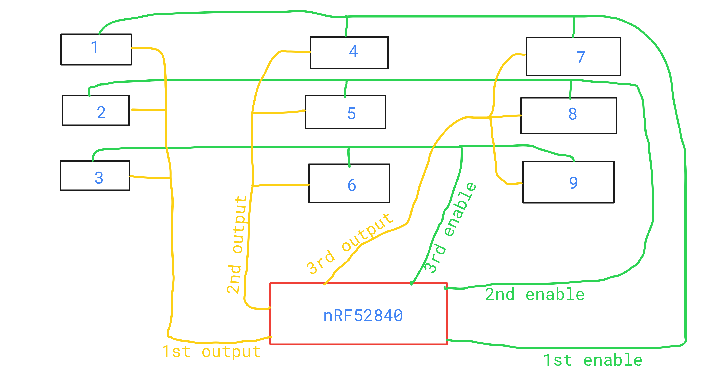
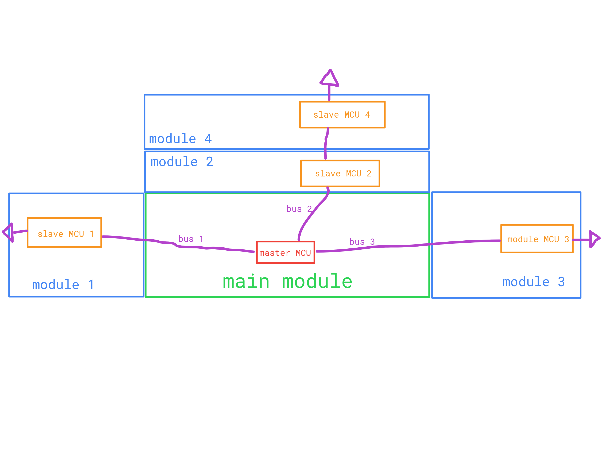

## 2025.12.16 - 4.5 hours:

### Research on analog keyswitches, MCU and Trackpoint.

Initially considered ESP32-S3, because of wireless capabilities and large amount of I/O, but eventually decided on the nRF52840, due to improved power consumption and full control over 2.4GHz radio, which allows to create a custom dongle.

Don't want to use XIAO nRF52840 or a similar breakout board because of space constraints and my desire to learn SMD soldering.

Cheapest nRF52840 in a QFN-73 package (only this one has USB-D pins): https://www.aliexpress.com/item/1005005069398861.html
Also there's one on LCSC (JLCPCB): https://www.lcsc.com/product-detail/C190794.html

Apparently I don't need an expensive J-Link or nRF52840 devboard for flashing a bare nRF52840 SMD chip, it can be done with RPi (for example RP2040) with firmware like pico-debug or picoprog.

Decided to go with "Gateron Double-Rail Magnetic Dawn" switches (https://www.aliexpress.com/item/1005006788772072.html), as they're cheap and have a standard (Cherry MX) physical dimensions.

TrackPoint uses PS/2 and is compatible with QMK and ZMK.

This TrackPoint module seems promising: https://holykeebs.com/products/sk8707-01-trackpoint-sensor

## 2025.12.17 - 2.5 hours:

### Power management and TMR sensor research.

Power management:
Gonna use Microchip MCP73871. It got full battery and power-path management, so I just gotta connect VBUS (USB-C) -> IN and OUT -> VDDH (nRF52840) + other 5V things.
AliExpress: https://www.aliexpress.com/item/1005008336731440.html
LSCS: https://www.lcsc.com/product-detail/C511310.html

TMR sensor:
Allegro CT8150PC should work, but the specific placement relatively to the Gateron Double-Rail Magnetic switches is questinable. Has ±8mT sensitivity range. ChatGPT suggests that the magnet should remain in the 2.5-5mm range from the sensor for it to work reliably, while the key travel is 4mm. It's especially likely that it will come too clode to the sensor. Will have to actually test this before making the PCB design.
Will use SOT package.
Turns out they're really expensive. Found them only at LCSC (https://www.lcsc.com/product-detail/C22879138.html) for ~1.23€(1.5$)/pcs at 100+. Will try to find something cheaper.
Found a little cheaper at DigiKey (just 0.83€/pcs at 100+): https://www.digikey.ee/en/products/detail/allegro-microsystems/ct8150pc-is3/22114148

Analog multiplexers:
Since nRF52840 can use just 8 pins for SAADC, I'm gonna have to use multiplexers. Found Texas Instruments CD4051B, they have 3 address pins, 8 inputs/outputs and can be disabled.
I could wire all the address pins to 3 pins on nRF, MUXs' outputs are connected in groups of 3 to 3 ADC pins on nRF (so 1 ADC pin per 3 MUXs) and then I use 3 pins, each connected to 3 MUXs from different groups, on nRF to enable the MUXs and allow it to read each TMR sensor independently. So it's basically a matrix.

Will go with SOP-16 package for easier assembly.
Cheapest at LCSC: https://www.lcsc.com/product-detail/C87646.html
AliExpress: https://www.aliexpress.com/item/1005009321962080.html

## 2025.12.18 - 2h:

### Alternative analog sensors, battery, module MCU

Looked into cheaper TMR and HE sensors, but didn't find any.

Decided to use a Li-Po battery like this: https://www.aliexpress.com/item/1005003462939882.html

Will use nRF52840 for modules as well, as I'll have to buy them in bulk anyways.
Probably will have to use multiple I2C buses to mitigate capacitance. Will add MOSFETs on SDA and SCL on the modules to keep them disconnected until the module MCU powers up completely, to prevent unexpected spikes. Modules are going to set an "advertisement" address on startup, the main MCU will contact that address for module type and then assign it a unique address for the session.

